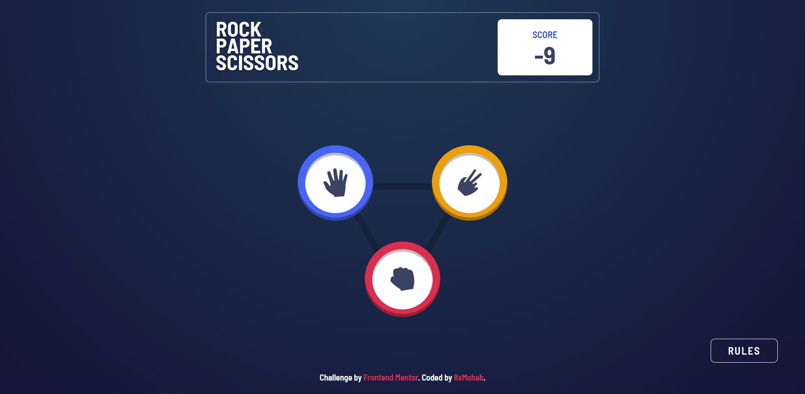

# Frontend Mentor - Rock, Paper, Scissors solution

This is a solution to the [Rock, Paper, Scissors challenge on Frontend Mentor](https://www.frontendmentor.io/challenges/rock-paper-scissors-game-pTgwgvgH). Frontend Mentor challenges help you improve your coding skills by building realistic projects.

## Table of contents

- [Overview](#overview)
  - [The challenge](#the-challenge)
  - [Screenshot](#screenshot)
  - [Links](#links)
- [My process](#my-process)
  - [Built with](#built-with)
  - [Continued development](#continued-development)
  - [Useful resources](#useful-resources)
- [Author](#author)

**Note: Delete this note and update the table of contents based on what sections you keep.**

## Overview

### The challenge

Users should be able to:

- View the optimal layout for the game depending on their device's screen size
- Play Rock, Paper, Scissors against the computer
- Maintain the state of the score after refreshing the browser _(optional)_
- **Bonus**: Play Rock, Paper, Scissors, Lizard, Spock against the computer _(optional)_

### Screenshot

### Links

- Solution URL: [GitHub](https://github.com/8xMohab/rock-paper-scissors)
- Live Site URL: [GitPages](https://8xMohab.github.io/rock-paper-scissors)

## My process

- The app is devided into two stages Picking and Result stage and based on the current stage we render the right component. The fist component renders the items in the [Items](./src/GameLogic.js) list using the [Item](./src/features/item/Item.jsx) component.

- Once the user picks an item we go to the "compare" stage where's a function called CalcWinner in [CalcWinner](./src/GameLogic.js) is used to determine the winner and returns an object containing the winner and House's pick.

- Then the [Result](./src/features/Result.jsx) component renders the winner's and the House's pick, animates the result text ("You win/You lose/Draw"), play again button and updates the score.

### Built with

- [React](https://reactjs.org/) - JS library
- [Redux](https://redux.js.org/) - State management JS library
- [Tailwind CSS](https://tailwindcss.com/) - CSS framework
- [Pixabay](https://pixabay.com/) - For sound effects
- Mobile-first workflow

### Continued development

Some refactoring and polishing to the code.

### Useful resources

- [Redux essentials](https://redux.js.org/tutorials/essentials/part-1-overview-concepts) - I'd recommend it to anyone still learning this concept.

## Author

- Frontend Mentor - [@8xMohab](https://www.frontendmentor.io/profile/8xMohab)
- Twitter - [@8xMohab](https://www.twitter.com/8xMohab)
